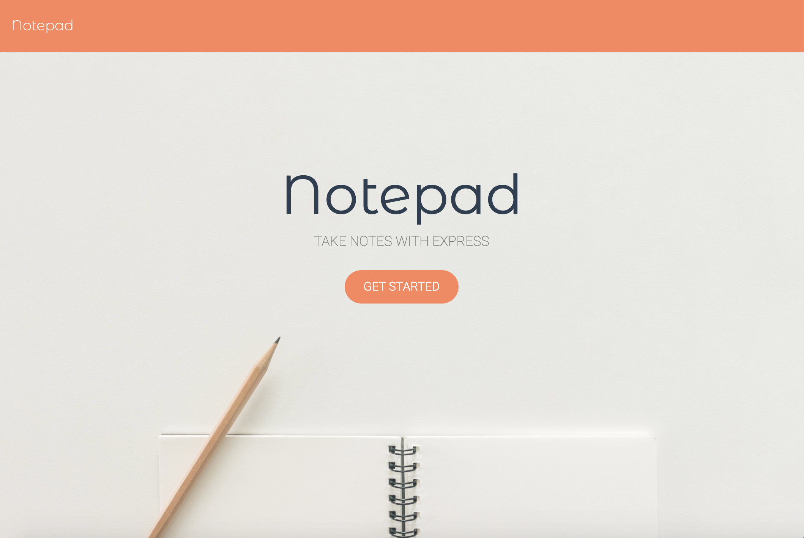

# [Notepad (Express.js)](https://jp-express-notepad.herokuapp.com/) 

## Description
Organize your thoughts with Notepad, a note taking application built with Express.js. Notepad helps the user keep track of everything they need to remember, by allowing them save, view, and delete notes.

## Table of Contents
* [Usage](#usage)
* [Technologies](#technologies)
* [Finished Product](#finished-product)
* [Credits](#Credits)
* [Questions](#questions)

## Usage
* Navigate to the [deployed Heroku App](https://jp-express-notepad.herokuapp.com/).
* Click the get started button.
* Add a note title and body in the provided text box.
* Save your note by clicking the save icon.
* View a list of your saved notes on the left hand side.
* Click on any note in the list to view your full note.
* Create a new note at any time by clicking the pencil button.

## Technologies
* JavaScript
* Node.js
* Express.js

## Finished Product
View deployed Heroku app [here](https://jp-express-notepad.herokuapp.com/). 

## Credits
* Background photo by [Tirachard Kumtanom](https://www.pexels.com/@tirachard-kumtanom-112571) from Pexels

## Questions
​
If you have any questions about the repo, please contact me:

On GitHub: [jpreston-alt](https://github.com/jpreston-alt) | Via Email: joannappreston@gmail.com
