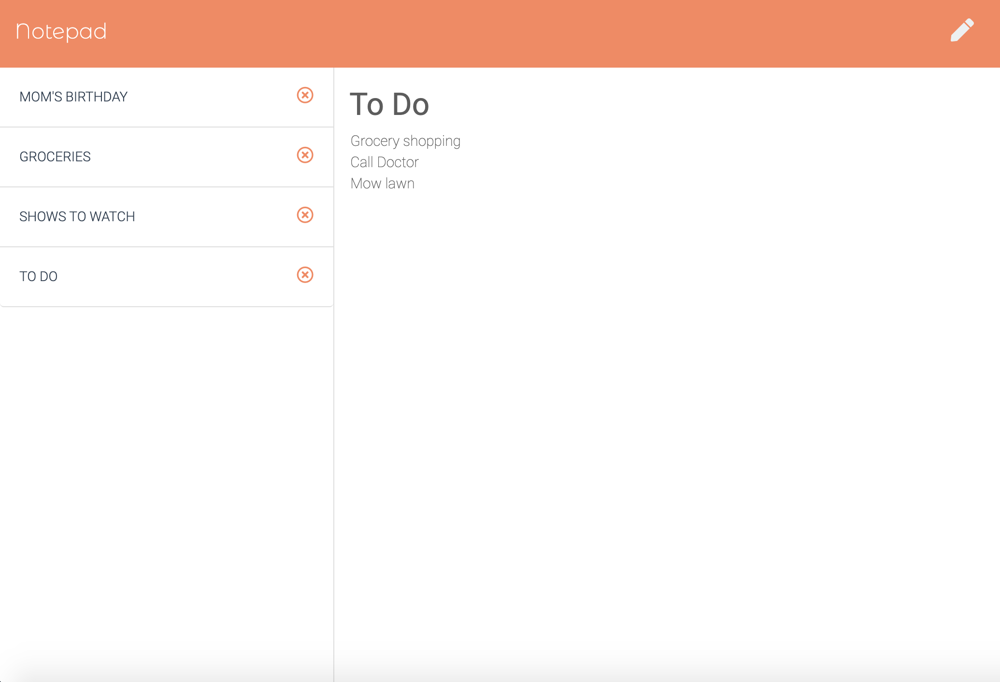

# [Notepad (Express.js)](https://jp-express-notepad.herokuapp.com/) 

## Description
Having trouble keeping track of all the tasks you were supposed to complete? How about remembering your grocery list? Then look no further than Notepad! Notepad is a full-stack note-taking application, built with Express.js, that will store your thoughts and to-do's, so that your brain doesn't have to. Users are able to save, view, and delete notes at any time by accessing and writing data to a JSON file. Your brain space is precious, so give your mind a break, and organize your thoughts with Notepad!

This application taught me about building a back-end server using Express. I learned about connecting that server to a front-end so that it is able to recieve get, post, and delete requests, and respond accordingly. I also learned about storing data that persists on a server by generating JSON files based on user input. And about how to use that data to build server-side API's. The full-stack journey is nearly complete!

## Table of Contents
* [Technologies](#technologies)
* [Usage](#usage)
* [Finished Product](#finished-product)
* [Credits](#Credits)
* [Questions](#questions)

## Technologies
* JavaScript
* Node.js
* Express.js
* Heroku
* HTML
* CSS
* Bootstrap

## Usage
* Navigate to the [deployed Heroku App](https://jp-express-notepad.herokuapp.com/).
* Click the get started button.
* Add a note title and body in the provided text box.
* Save your note by clicking the save icon.
* View a list of your saved notes on the left hand side.
* Click on any note in the list to view your full note.
* Create a new note at any time by clicking the pencil button.
* Delete any note by pressing it's "X" icon.

## Finished Product
View deployed Heroku app [here](https://jp-express-notepad.herokuapp.com/).

## Credits
* Background photo by [Tirachard Kumtanom](https://www.pexels.com/@tirachard-kumtanom-112571) from Pexels

## Questions
​
If you have any questions about the repo, please contact me:

On GitHub: [jpreston-alt](https://github.com/jpreston-alt) | Via Email: joannappreston@gmail.com
